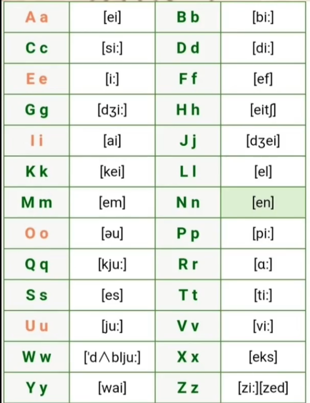

# 一、不定冠词a和an的用法


## 1、不定冠词 a 和 an 的用法

**用法:** 

**辅音前面用 `a` , 元音前面用 `an`** 

**用法说明 :**

是根据**不定冠词**后面**单词首字母的发音**(读音)是**元音 ** 还是  **辅音** 来决定的. 如果首字母发音是辅音则用`a`, 是元音则用`an`


下面我们来复习一下英语中的音标

- 元音(20个)

  ```
  # 单元音 (前/后/中)
  [iː] [ɪ] [e] [æ]  [ɑː] [ɒ] [ɔː] [ʊ] [uː]		[ʌ] [ɜː] [ə]
  
  # 双元音 (合口/集中)
  [eɪ] [aɪ] [ɔɪ] [əʊ] [aʊ]  [ɪə] [eə] [ʊə]
  ```

- 辅音 (28个)

  ```
  # 清辅音 (爆破/摩擦 ...)   9个
  [p] [t] [k]  [f] [θ] [s] [ʃ] [tʃ]  [h]
  
  # 辅音
  [b] [d] [g]  [v] [ð] [z] [ʒ] [dʒ]  [r][m][n][ŋ][l][w][j] 
  
  # 辅音连缀
  [tr] [dr] [ts] [dz]
  ```


- 26个字母发音

​	 


## 2、示例:

- 英文字母

  ```
  # 26个字母 不定冠词用法
  an a, a b  ...
  
  口诀:
  Mr Li has one fox # 这些字母前用an
  ```

- 练习

  ```
  1. There is (  ) "a" and "n" in the word "and".
  
  2. There is (  ) "h" and (  ) "u" in the word "hour".
  
  3. He always wears (  ) uniform.
  
  4. Does Ann have (  ) umbrella.
  ```

  


