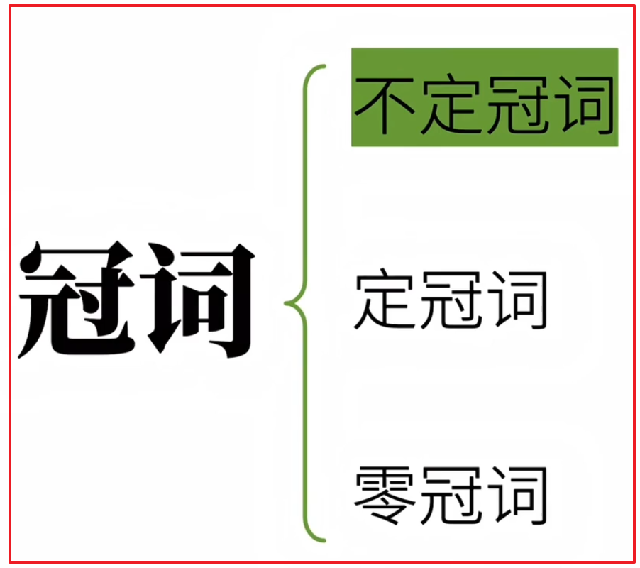
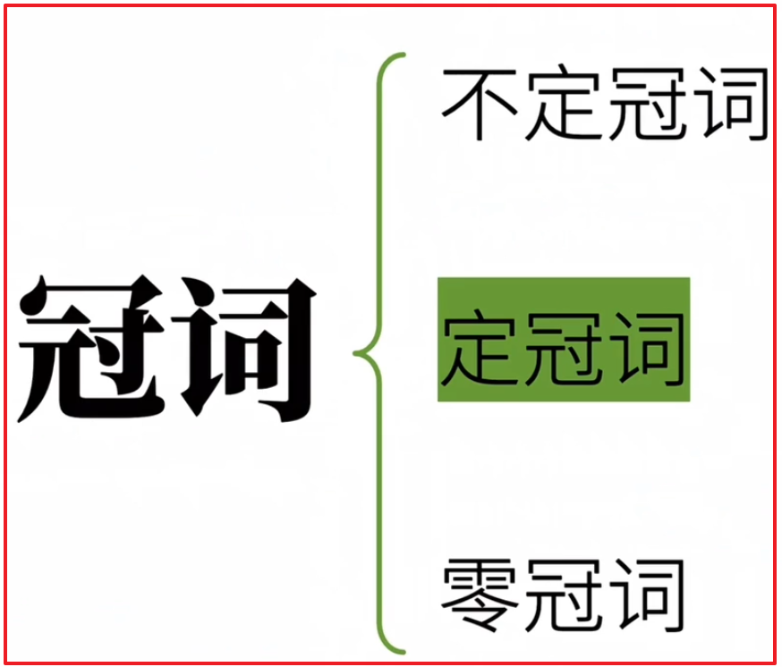
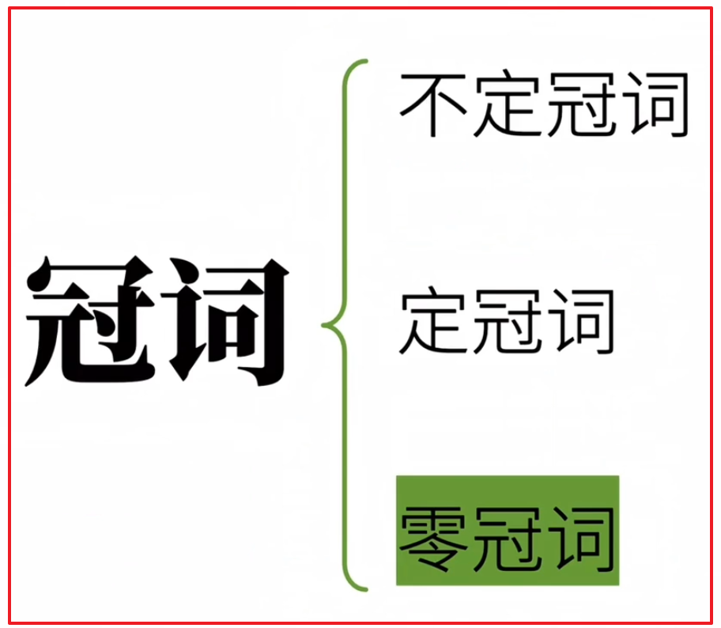

# 冠词

## 生词:

- **spring**	[sprɪŋ] n.春天;弹簧;春季

- **rabbit**	[ˈræbɪt]	n.兔子;兔;兔肉;野兔

- **university**	[juːnɪˈvɜːsəti]	n. 大学

- **hour**	 [ˈaʊə] n.小时

- **see** 	[siː] v.看见;见到;看出

- **saw**  see 的过去式

- **smart** 	 [smɑːt] adj.聪明的;机敏的;精明的;

- **smarter**   smart 的比较级 (更聪明的)

- **than**	 [ðæn] prep 比, 多于

  > Rabbits are smarter than wolves. 兔子比狼聪明

- **wolf**	[wʊlf] n. 狼

- **wolves**  [wʊlvz]	wolf 的复数形式

- **eat** 	[iːt] v.吃

- **eating**  eat 的现在分词

- **carrot**	[ˈkærət] n.胡萝卜

- **give** 	[ɡɪv] v. 给, 给与

- **gave**	[geiv] give 的过去式

- **hundred**	 [ˈhʌndrəd] num. 一百

  > one hundred,  two hundred, three hundred 

- **teach** 	[tiːtʃ] v.教(课程);讲授;教授;教;训练;

- **teacher** [ˈtiːtʃə]  n.教师;教员;老师;

- **create** 	[kriˈeɪt] vt.创造;创作;创建;

- **creator** [kriˈeɪtə] n.创造者;创作者;发明者

- **time**  [taɪm] n. 时间

  >  have a good time 玩得开心

- **as** 	[æz] prep 像;如同;作为;当作

- **result**  [rɪˈzʌlt] n.后果;结果

  > as a result 因此;结果

- **hurry** 	[ˈhʌri] n.匆忙;急忙

  > in a hurry 匆忙的

- **all**   [ɔːl] pron 所有;全部;全体;一切

- **of**  [ɒv] prep 属于(某物);属于(某人);关于(某人);

- **sudden** [ˈsʌdn] adj. 突然的;忽然的

  > all of a sudden 突然

- **first** [fɜːst] adv 首先;第一

- **big** [bɪɡ] adj.大的;(体积、程度、数量等)巨大的

- **biggest** [ˈbɪgɪst]  big 的最高级  (最大的)

- **sun** [sʌn] n.太阳;阳光;日光

- **moon** [muːn] n.月球;月亮;月相;卫星

- **earth** [ɜːθ] n.地球;陆地;地面;

- **great** [ɡreɪt] adj.伟大的;巨大的;极大的

- **wall**  [wɔːl] n.墙壁;城墙;围墙

  > the Great Wall 长城

- **piano** [piˈænəʊ] n. 钢琴 

- **guitar**  [ɡɪˈtɑː] n.吉他

- **violin** [vaɪəˈlɪn] n.小提琴

- **flute** [fluːt] n.长笛;

- **computer** [kəmˈpjuːtə] n.计算机;电脑

- **has** [həz]  have [hæv]的**第三人称单数**现在时形式

- **change** [tʃeɪndʒ] v.改变;变化;兑换;找零; n.变化;改变;变更;

- **changed** change的过去式

- **our** [ˈaʊə] 我们的;

- **way** [weɪ] n.方法;手段;途径;方式;路线;

  > **by the way**	顺便

- **of**	 [ɒv] prep 属于(某物);属于(某人);关于(某人)

- **life**  [laɪf] n.生活;生命;人命;性命;

  > save  [seɪv]  my life 救命,救救我

- **rich**  [rɪtʃ] adj. 富有的;富饶的;

  > the rich 富人, 有钱人

- **poor**   [pɔː] adj.贫穷的;可怜的;贫寒的;清贫的; 

  > the poor 穷人

- **should** [ʃʊd] 应当; 本应

- **time**  [taɪm] n. 时间;

  > **all the time** 一直/总是

- **question**  [ˈkwestʃən] n. 问题;疑问

  > **out of the question**   没门,没可能

- **water** [ˈwɔːtə] n.水

- **important**  [ɪmˈpɔːtnt] adj.重要的;

- **breath** [breθ] n.一次吸入的空气

- **take** [teɪk] v.拿;携带;接受;

- **out** [aʊt]  (从…里)出来;出去;外出;不在家;

  > take a breath 休息一下 
  >
  > out of breath (快笑掉大牙)喘不过气了

- **breathe** [briːð] v.呼吸;呼出;低声说;

- **air**  [eə] n.空气;空中;天空;

- **hot** [hɒt] adj.热的;温度高的;

- **cold** [kəʊld] adj.寒冷的;冷的; n.冷;寒冷;感冒;伤风;着凉

- **want** [wɒnt] v.希望;想要;要;需要;

  > I want to go to school on Monday.

- **geography** [dʒiˈɒɡrəfi] n. 地理(学);地理环境;

- **January** [ˈdʒænjuəri] n. 一月   简写 Jan

- **February**  [ˈfebruəri] n. 二月  简写 Feb

- **March** [mɑːtʃ] n.三月  	简写Mar

- **April** [ˈeɪprəl] n. 四月 简写 Apr

- **May** [meɪ] n.五月

- **June** [dʒuːn]  n.六月 简写 Jun

- **July**  [dʒuˈlaɪ] n.七月 简写 Jul

- **August** [ˈɔːɡəst] n.八月 简写 Aug

- **September** [sepˈtembə] n.九月  简写 Sep

- **October** [ɒkˈtəʊbə] n.十月  简写Oct

- **November**  [nəʊˈvembə] n.十一月  简写Nov

- **December** [dɪˈsembə(r)] n.十二月 简写 Dec

- **nation**  [ˈneɪʃn] n.国家,民族

- **national**   [ˈnæʃnəl] adj. 国家的;民族的;全国的;

  > on National Day  在国庆节

- **from  time to time** 不时地

- **face**  [feɪs] v.面对;面向;正对;面临 n.脸;面孔;面部表情

  > face to face 面对面

- **question** [ˈkwestʃən]  n.问题, 疑问

  > out of the question 没门, 不可能
  >
  > out of question 毫无疑问

  

## 1、开篇

在学习英语的过程中,一提到**冠词article  [ˈɑːtɪkl]**, 有人就会说不就是 **a/ an/ the** 吗? 这太简单了.

但是, 在英语学习中**冠词article**看似简单, 却是咱们中国人说英语时**最常见的错误之一.** 

比如: 中文说 **"春天"**,  那对应的英文是啥? 

 

你的第一反应是**a spring**, **the spring**, 还是 **spring**?  

其实这几种表达都是正确的. **只是**它们具备(包含)了中文所没有的 **"附加信息"**, 因为中文里根本没有 **"冠词" **的用法.  当我们中国人说到 **"春天"** 时, 永远都是 "春天"没有附加信息, 但是 **英语母语人士**会本能地把 **spring** 归为**三类**,

即我们马上要说的: 

- **不定冠词:** a spring
- **定冠词:**  the spring
- **零冠词:** spring

它们在不同的语境下意义和用法有所不同. 实际上冠词的细枝末节可以很复杂. **不过这次我们先来说说(了解下)冠词相关的最重要最核心的概念**

在英语中冠词分为: **不定冠词、定冠词、零冠词**三类

## 2、不定冠词a/ an

 

### 1、不定冠词的发音

**不定冠词该用a 还是用an, 就是看后接单词的发音.** 

注意: **是发音(音素)不是字母**. 

- **后接单词发音以 元音开头 用 an**

  > an apple [ˈæpl]  一个苹果,
  >
  >  an elephant  [ˈelɪfənt]一只大象,
  >
  >  an hour  [ˈaʊə]  一小时
  
- **后接单词发音以 辅音开头 用 a**

  > a tiger	[ˈtaɪɡə] 一只老虎, 
  >
  > a monkey	[ˈmʌŋki] 一只猴子
  >
  > a university [ˌjuːnɪˈvɜːsəti] 一所大学
  >
  > a rabbit [ˈræbɪt]一只兔子

### 2、不定冠词的用法

#### 1、泛指某一个

不定冠词最重要的用法之一是: **泛指某一个(类)人或物.**  

**注意:** 是某一个!

比如:

**I saw a rabbit**  翻译为: "我看见一只兔子" 或者  "我看到兔子了"

- 咱们中文习惯翻译为:  "我看见一只兔子", 但是正如我们前面提到的中文里没有英语 "不定冠词" 的说用法, 所以**"a"**算是被强行翻译成了**"一只"** , 但是我们要意识到,**这里的一只并不是完全强调数量上的一只而是泛指某一只兔子, 是指兔子这一物种中的某一只**,  所以咱们还可以把这句话翻译成  **"我看到兔子了"**

- 那我们为啥不能按照中文的习惯说: "I saw rabbit.", 其实这就是我们英语最常见的错误.  **不能这么说的原因是rabbit前啥冠词都不用的话, 就属于英语中零冠词的范畴了**, 用法和意义又有不同. 

- 其实, 如果我们第一次提到某个事物某个人, **从某种意义上来说也可以算是泛指的,毕竟在第一次提到时说话者和听话者 都不知道具体指的是 那个人 或者 物嘛**. 

  > **比如:** 
  >
  > 你跟别人说:  "我今天看到只兔子, 这兔子跑的很快"
  >
  > - 前半句第一次提到兔子, 可以说是泛指,因为此时对方其实不是很清楚你正在说的这个兔子,  因此就用不定冠词: **'I saw a rabbit'** 来表达泛指一只兔子.
  >
  > - 前半句你第一次提到兔子用 **"a rabbit"** , 后半句你再次提到前半句的兔子, 就要使用定冠词 **"the rabbit"** 来表达, 说明是前半句提到的兔子. 
  > - 因此完整的表达应该是: **"I saw a rabbit, the rabbit run fast"**

#### 2、泛指某一类

**不定冠词重要用法泛指某一类人或物**, 注意: 是一类

比如把: A rabbit is smarter than a wolf.  翻译成**"一只兔子比一只狼聪明"** 是不是感觉有点奇怪? 

因为并没有明确指出是哪只兔子比哪只狼 聪明啊. 实际上这里的 "a rabbit" 和 "a wolf" 是泛指 "兔子" 和 "狼"  这两类动物. 一旦泛指某一类事物就不好用"一个", "一只"来翻译了对不对? 

所以, 这句表达的意思就是**"兔子比狼聪明"**, 这是显而易见的. 你也能看出这时很明显的泛指对不对? 

不过呢, 这句话实际上也是有歧义的,咱们确实也能把它理解为: "(某)一只兔子比(某)一只狼聪明", 而相反的这样的句子 "A rabbit is eating a carrot" 虽然句子结构和 "A rabbit is smarter than a wolf" 非常相似, 很明显就不是泛指. 而是说某一只兔子在吃一根胡萝卜. 那么 "A rabbit is smart" 这句话到底是泛指兔子这类动物聪明还是说某一只兔子聪明呢? 那就的看具体语境, 以及你怎么理解了. 

**所以, 虽然不定冠词做泛指语法上没有错, 但更好的方式是咱们之后要说到的"零冠词"**,  Rabbits  are smarter than wolves 兔子不狼聪明, Rabbits are smart 兔子聪明(兔子是聪明的动物), 这样表达是不是会更好呢? 这就是我们后面要讲的 **零冠词**

####  3、表示数字 "1"

不定冠词 a/ an有的时候就是用来表示数字"1" 的, 比如: "I  gave you **a** hundred carrots" 我给了你100根胡萝卜, 相当于 "I  gave you **one** hundred carrots"

#### 4、表示 "每"

I   eat 10 carrots **a** day. 我每天吃10根胡萝卜.  这句话相当于 I eat 10 carrots **every** day.

#### 5、主谓一致

咱们之前在讲"主谓一致" 原则时提到: **不定冠词还能影响主语的单复数,从而影响句意**, 

比如:

- a teacher and video creator 一位老师兼视频创作者
- a teacher and a video creator  一位老师 和 一位视频创作者

前者指的是一个人, **a 泛指兼职老师和视频创作者的一人**. 后者是指两个人, 一个人是老师一个人是视频创作者. **a 在这里泛指一位以老师为职业的人和一个以视频创作为职业的人.** 

#### 6、固定表达

还有一些固定表达中含不定冠词, 比如: 

- have a good time 玩的开心
- as a result  因此; 结果
- in a hurry 匆忙地.  
- all of a suddent 突然

> 这其中的a既不能改成定冠词the, 也不能省略成零冠词. 

以上就是不定冠词的主要用法. 还有些次要的, 稍显琐碎的, 咱们先略过. 

 

## 3、定冠词the

 

### 1、发音

the 的发音有两种:  [ðə] 和  [ði:].它的发音与不定冠词的发音如出一辙, 就是看后接单词的发音.

- 后接单词发音以元音开头,此时the发 [ði]:]音

  > the apple [ði: ˈæpl], the hour  [ði: ˈaʊə(r)] 

- 后接单词发音以辅音开头,此时the发[ðə]音

  > the tiger  [ðə ˈtaɪɡə(r)] ,the university   [ðə ˌjuːnɪˈvɜːsəti]

### 2、the + 名词--表示特指

定冠词的主要功能就是**特指**, **表示某个或某些特定的人或物,** 也就是, **说话者和听话者都知道在讨论啥, 再次提到的某人或事物**. 

**如果对话双方再次提及某人某物(即双方都清楚说的是谁或者什么)就用定冠词the.** 

### 3、the+名词--(再次提到)表示特指

前面咱们说**不定冠词**时, 说到一句中文例子: **"我今天看到一只兔子, 这只兔子跑的很快"**

前半句是**第一次提到**某只兔子, 所以说: **"a rabbit** ", 后半句因为**再次提**到, 就要用 **"the rabbit"** 所以整句话英文是: **"I saw a rabbit. The rabbit ran  fast".**

- 句中的 "a rabbit" 泛指某只兔子,具体不知道是哪一只
- 句中的 "The rabbit" 是特指上句刚说的那只我看到的兔子. 

**如果你非要说成: "I saw a rabbit, A rabbit ran fast" 这样的话英语母语人士会感到很迷惑. 难道这里有两只兔子吗? 后半句那只兔子到底是哪只啊.** 

这再次体现了咱们中西方思维习惯的不同. 咱们中文因为没有英语不定冠词和定冠词的用法, 所以怎么说兔子都是兔子, 但是你要是英文也随便来, 那很可能会引发歧义, **让英语母语人士一头雾水.** 

### 3、 the+名词--(明确说明某事某物)表示特指

    

再比如下面这句话: **"请给我胡萝卜"**. 

如果你写成 **" Please give me a carrot"** 这时 **a carrot** 表示的是**泛指某根胡萝卜**具体那根不确定.假如你现在有很多根胡萝卜, 随便拿一根给我即可.

 但是, 如果你写成 **"Please give me the carrot"**  那就是**特指对话双方都知道的那根胡萝卜**, 是具体的某一根,不能随便拿.

> **换句话说, 特指,指的就是对话双方都知道的某人 或某事物**, 而泛指仅仅是一种含义的描述不需要详细指明/说明

### 4、the + 序数词--表示特指

**序数词限定了范围, 所以也是特指**. 

比如我们说第一只兔子, 应该这样老说:" the **first** rabbit".

因为 **first** 已经是**特指序列排第一**的兔子了.  所有序数词前要用 **"the"**  表特指.

### 5、the+形容词最高级前--表示特指

 **最高级限定了范围, 所以也是特指**. 

同样, 当我们要表示**最大的一根胡萝卜**时, 我们需要这样来说 : "the biggest carrot "

因为最大的已经限定了范围,所以也是表示特指, 所以也要用 **"the"**

### 6、the+独一无二的名词前--表示特指

在太阳系中, 太阳、地球、月亮都是是独一无二的事物, 所以显然还是特指. 于是乎, 一类事物前要用定冠词 **the** 

即: 

- **the sun** 太阳
- **the moon**  月亮 
- **the earth** 地球

而, 咱们中国的 长城也是世界上独一无二的存在,  当我们要说长城时要说: **"the great Wall"**

### 7、the 表泛指(特殊)

前面我们谈到 **the** 的用法都是**"特指"**, 那能不能表示泛指呢?  其实在某些情况下也是可以的, 只是稍稍少见, 比如: **西洋古典乐器**

**I like playing the piano  我喜欢弹钢琴**

**play the piano** 你当然可以理解为特指, 弹一架特定的钢琴, 但是从这个句子上下文看, "我喜欢弹钢琴 " 应该指的是 弹钢琴这一行为,  是泛指弹钢琴这件事, 那你可能会问了, a 也可以表示泛指, 那  **"play a piano"** 可不可以呢? 当然是可以这样说 的, 但是这里的意义就会有所不同.  **a  piano** 是泛指(可能有很多架钢琴, 随意找一架弹) 也就是说,咱们讨论的不再是"弹钢琴"这个音乐艺术行为或爱好, 而是单纯说"弹一架钢琴这一动作"

相似的还有: 

**play the guitar 弹吉他.  play the violin 拉小提琴 play the flute 吹笛子**

再看一个例子:

The computer has changed our way of life.

这句话改怎么理解呢? 难道是特指某一台电脑改变了我们的生活?  不太对吧, **The computer** 在这里应该是泛指的意思,  意思是 computer 作为整体一类工具. 有点复杂, 有点混乱. 这种感觉很正常. **因为这样的句子就很容易产生歧义** . 

所有在英语中如果要泛指, 推荐后面会介绍的 **"零冠词"**

### 8、the + 形容词--指代一类人

- the rich	富人
- the poor 穷人

这里虽然也指泛指, 但是这是一个很 "厉害的用法", 因为它居然把形容词转成了名词. 所以咱们可以说:

The rich should help the poor. 富人应该帮助穷人. 

### 9、固定表达(特殊)

有些固定表达中只能用 the, 比如: 

- all the time	一直,总是
- by the way    顺便
- out of the question    不可能,没门

其中的the 非常的关键, 如果省略往往会成为截然不同的意思. 后面我们我们会讲. 

以上是定冠词最常用,最核心的用法

## 4、零冠词

 

何谓零冠词, 在英语中名词前面不用冠词的情况, 我们称为**零冠词**, 零冠词的**主要作用是泛指.**  下面我们一起来看看. 

### 1、零冠词--复数泛指

在不定冠词的部分我们提到过 "a rabbit is smart" 可以泛指(所有)兔子聪明. 但是这样的句子一不小心就会被误解. 因为视具体语境, 既可以泛指兔子这一类动物聪明, 也可以泛指某一只兔子聪明. **所以更好的方式是说: "Rabbits are smart"** 这就是零冠词复数泛指的用法.  

**注意:** 

**"Rabbits are smart"**  不是说复数的几只兔子聪明, 而是泛指兔子这类动物很聪明. 

在定冠词的部分, 我们也提到过 **"The computer has changed our way of life"** 可以泛指(所有)电脑改变了我们的生活, 但是还是很容易被误解, 所以更好的方式是 **"Computers have changed our way of life"** 零冠词复数泛指.

**看到没有, 相比之下零冠词复数是非常准确有效的泛指, 不容易引发歧义.**  那你可能又问, 那不可数名词没有复数怎么办呢?  不可数名词怎么使用零冠词复数泛指呢? 

很简单啊, 你把这些不可数没名词理解成 不需要加s 或es 的复数形式即可,比如:

- Water is important	水很重要. 

- We breathe air	我们呼吸空气

咱们照样可以把这样的用法理解为零冠词复数泛指. 

### 2、零冠词--泛指概念

这里说的"概念" 是你脑中形成的观念. 是一种抽象意义的表达. 这种概念性的名词前多会使用零冠词.  是不是有点抽象? 下面我们来看个例子:

Summer is hot, Winter is cold. 	夏天热, 冬天冷. 

一说到夏天和冬天, 咱们脑中就会形成相应的想法, 就像"夏天很热,冬天很冷", 这里的summer 和 winter 不是泛指某一个夏天或者冬天. 而应该理解为"夏季", "冬季"表示季节这一概念. 

为什么说之前的 "我看到兔子" 不能说成: "I saw rabbit". 因为 rabbit 很具象啊,  一般说到兔子,要不就是泛指兔子这一类动物, 要不就是指一只兔子, 很少用它表达抽象的概念 . 

那你可能又要问了, 那要说泛指, "Summers are hot" 可不可以呢? 

当然也是可以的, **所以,在表达一类人或事物时, 最保险的, 出现频率相对高的是复数泛指**.  

再看, 

**"I want to play football"**我想踢足球, 这里的 play football 泛指足球运动这一类抽象概念, 而不是某一只具体的足球或者足球这一类运动器具. 所以一般不说: "I want to play a football"

注意: 

在定冠词部分咱们提到过, play the piano, 也是泛指"弹钢琴"这一类活动, 按理说: play piano 就可以可嘛, play piano 的确也是可以的, 这也是为什么我之前说play the piano 这样的用法比较特殊. 西洋古典乐器才这样用. 你要是把乐器换成我们中国的二胡, 那么使用 play erhu 就可以了.  

再比如学科:

I like geography  我喜欢地理, 这里的地理泛指的是地理学科这一概念, 也是零冠词的用法. 还要季节、星期、月份、节假日等 in spring 在春节, in August 在八月, on Monday 在星期一,  on National Day 在国庆节

### 3、零冠词--专有名词

专有名词, 这个很好理解, 专有名词前一般都没有冠词(零冠词), 如: Papa Rabbit 兔老爹, 一说起Papa Rabbit 你应该就想到了英语兔了, 对不对,  你要是说 a Papa Rabbit 就好像有很多个Papa Rabbit 一样似的. 而你要是说 the Papa Rabbit 岂不是多此一举. 

### 4、零冠词--固定表达

还有一些固定表达使用的也是零冠词, 举个例子:

from time to time 时不时地.  face to face 面对面 out of question  毫无疑问

请特别注意最后这一个: out of question 与之相似的 out of the question 不可能/没门 表示的是否定, 而去掉the 变成零冠词后居然就是相反的意义了. 可见冠词真的很重要. 

以上就是零冠词最重要, 最核心的用法. 

## 5、总结

冠词分三类: 

- 不定冠词 a/an
- 定冠词 the 
- 零冠词

1.不定冠词多用于泛指, 常用于泛指某一个人或事物, 也可以泛指某一整类人或事物. 只不过泛指一整类时可能会引发歧义. 此外不定冠词还可以表示数字"一" 和 "每"等意思, 而且往往会对"主谓一致"造成影响. 

2.定冠词多用于指某个或某些特定的人或事物, 说白了就是指说话者和听话者都知道的人或物, 这也包括在交谈中第二次提及的人或物.  用序数词和最高级修饰人或物, 以及世界上独一无二的事物, 定冠词偶尔用于泛指, 这算是比较少见的用法. 另外定冠词用于某些形容词前表示一类人. 这种用法把形容词转化为名词

3.零冠词最常见的是: 复数名词泛指某一类事物. 但是单数也可泛指某个"概念", 此外专有名词词前多是零冠词

4.最后, 这三类冠词都有固定表达, 这些表达都有特殊含义, 省去冠词或换成其它冠词, 意义千差万别. 

